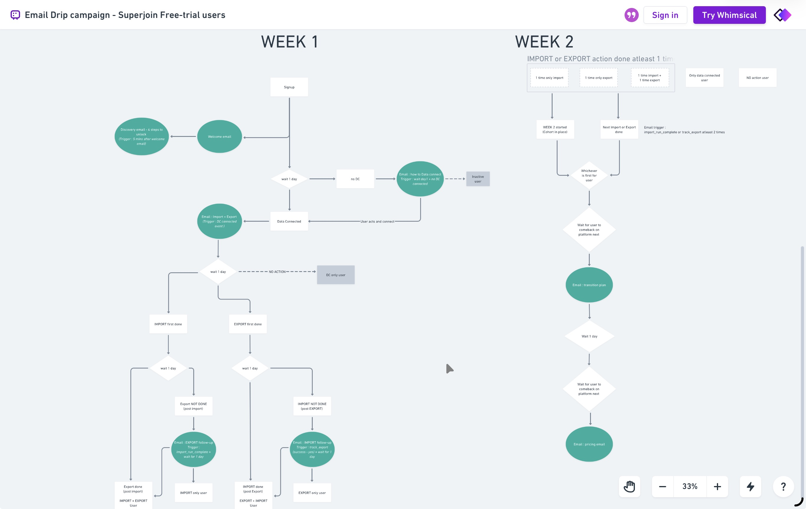
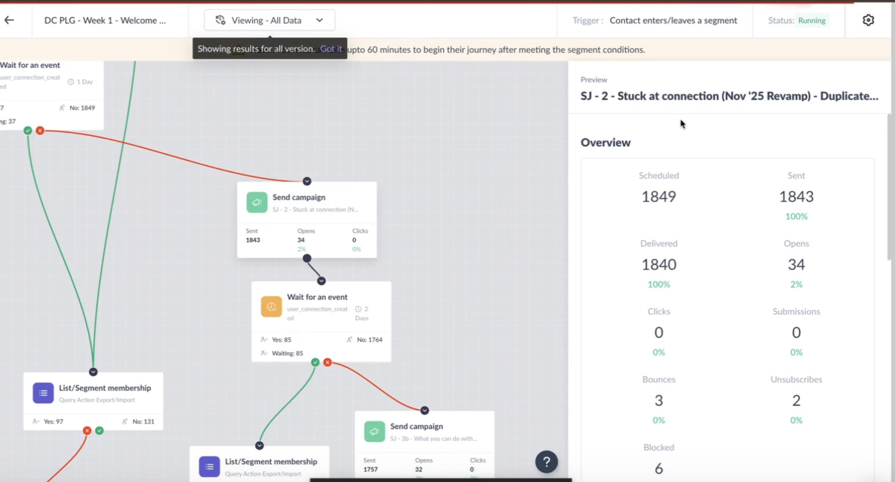
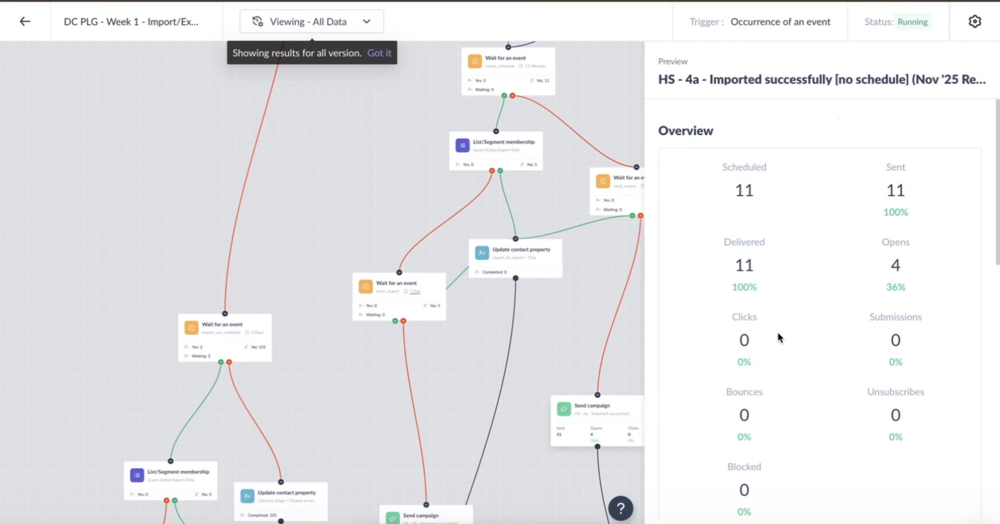
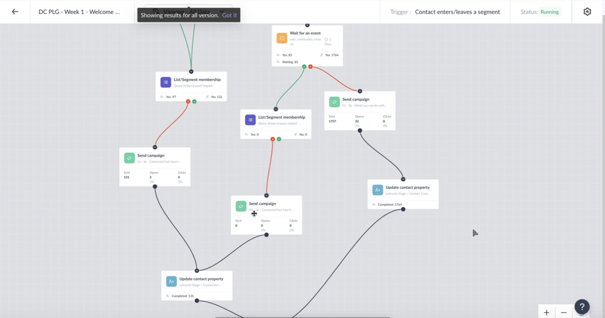
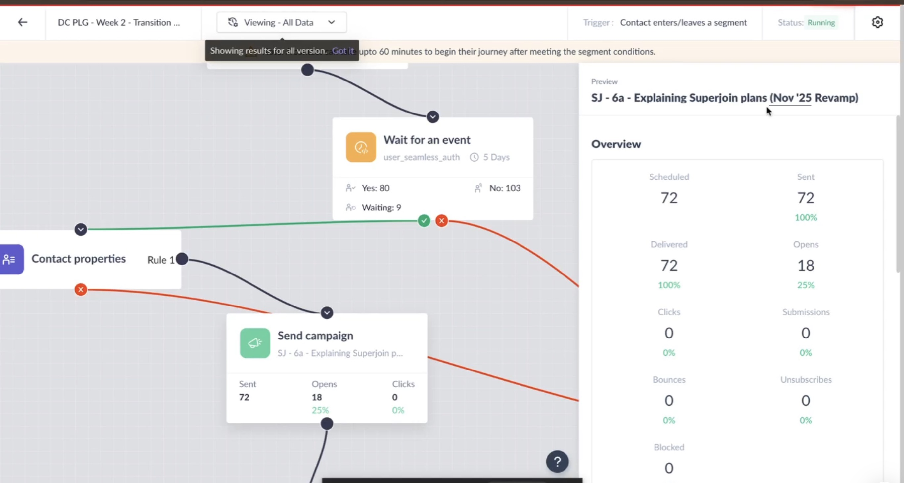
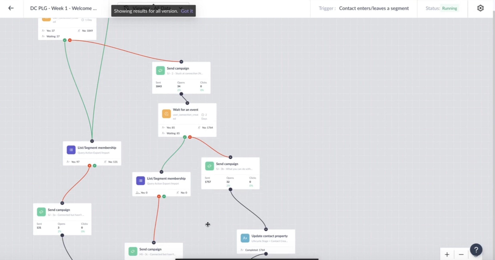
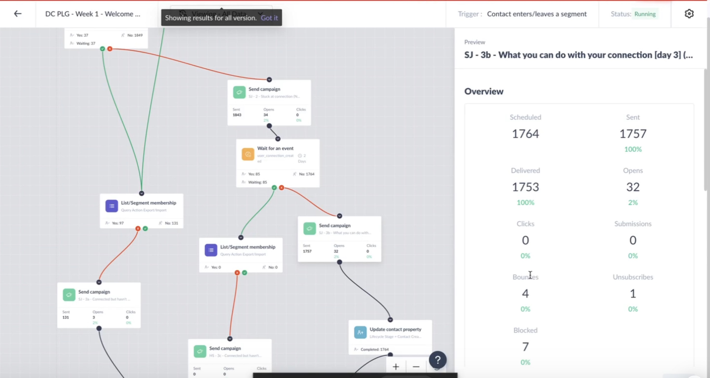

# Email Campaign 2.0 — Free-Trial Drip Redesign


---

## TL;DR

Superjoin's Email 1.0 drip campaign (May–Oct 2025) had **block rates of 6–11%** on key emails — users were flagging trial-end reminders as spam and the email address `alisha@superjoin.ai` was taking a reputation hit.

Email 2.0 (launched Nov 2025) rebuilt the entire drip from first principles using Mixpanel user journey data. The new system is **hybrid-triggered**: emails fire on user action OR a time threshold — whichever comes first — calibrated to how long average core + power users take to reach each activation milestone.

**Results after 2-week A/B test alongside live Email 1.0:**
- Block rate: **~0% across all journeys** (vs 6–11% in Email 1.0)
- Week 2 plan comparison email: **25% open rate**
- Import/export success use-case email: **36% open rate**
- Unsubscribe rate: **~0%**

---

## The Problem — Email 1.0 (May–Oct 2025)

### What broke

Email 1.0 was purely **event-driven** — emails only triggered when users took specific actions. This created three structural failures:

| Problem | Impact |
|---|---|
| Too many follow-up emails on important actions | Users felt hounded; high block rates |
| Communication gap in Week 2 | No contact during the critical middle of the trial |
| 3–4 trial-end reminders | Highest spam flags — users felt pestered |

### Block rate data — before numbers

**HS Journey 3 (Retention + Trial to PRO) — worst offenders:**

| Email | Sent | Block Rate |
|---|---|---|
| HS-10e — "Why didn't you convert?" | 558 | **11%** |
| HS-10c — "Trial ends tomorrow" | 623 | **8%** |
| HS-10b — "Customers are King/Queen" | 633 | **6%** |
| HS-10a — HubSpot specific features | 657 | **4%** |

**HS Journey 1 (Welcome + Connection):**

| Email | Block Rate | Action |
|---|---|---|
| HS-2d — Pausing till retention | **7%** | Removed entirely |
| HS-2c — Superjoin usecases | 4% | Improved + 5 cohort variants |
| HS-2b — Stuck at connection follow-up | 3% | Replaced |

> **Root cause:** Reactive emails timed to user inaction felt like pressure. Trial-end reminders sent 3–4 times felt like spam. No Week 2 communication meant users re-engaged cold with aggressive end-of-trial emails.

---

## The Solution — Email 2.0 Philosophy

### The core insight

Email 1.0 only sent emails when users *did* something (or didn't). Email 2.0 uses **Mixpanel user journey data** to understand *when* average core + power users reach each activation milestone — and uses that as a time-based fallback.

> **Hybrid trigger:** Email fires on user action OR N days after signup — whichever comes first.

A user who hasn't connected their data source after 3 days gets the "How to connect" email automatically — because data showed 3 days is when the average engaged user has already connected. The email catches users before they fall through the gap, without waiting for an event that may never come.

### Philosophy shift

| | Email 1.0 | Email 2.0 |
|---|---|---|
| **Trigger logic** | Event-driven only | Event OR time (whichever first) |
| **Timing calibration** | None | Based on avg core/power user journey data |
| **Approach** | Reactive follow-up | Proactive discovery |
| **Week 2** | No communication | Trust + plan comparison for engaged users |
| **End-of-trial** | 3–4 reminders | 2 reminders + reassurance framing |
| **User filtering** | None | Core + power users get dedicated Week 2 path |

### Priority objectives (in order)

| Priority | Objective | Status |
|---|---|---|
| 1 | **Email health** — block rate + unsubscribe rate | ✅ Achieved |
| 2 | **Open rate** — subject line + timing optimization | 🔄 In progress |
| 3 | **Click-to-action rate** — CTA clarity + content | ⏳ Next |
| 4 | **Inbound** — free-to-paid conversion influence | ⏳ Next |

> Low open rates on some emails (e.g. "Stuck at connection" at 2%) are **expected and intentional at this stage** — the time-based fallback catches users before they're ready to act. Subject line and timing optimization is Phase 2. High open rates on success-triggered and Week 2 emails validate the content strategy.

---

## The 3-Week Journey

### Framework overview



*Full interactive diagram: [Whimsical](https://whimsical.com/email-drip-campaign-superjoin-free-trial-users-KUD4uZn9NiHVPCchPgq2Fz)*

**Email 1.0 vs 2.0 side-by-side:**



---

### Week 1 — Activation

**Goal:** Get users to their first meaningful product action fast.

**Milestone sequence:** Connect data source → Use Superjoin AI → Import or Export → Increase frequency with use-cases

**Flow logic:**
```
Signup
  └── Welcome Email (immediate)
  └── Discovery Email — "4 steps to unlock Superjoin" (3 mins after welcome)
        └── Wait 1 day
              ├── DC connected → Email: Import + Export (event trigger)
              │     └── Wait 1 day
              │           ├── Import done (no export) → follow-up on export
              │           ├── Export done (no import) → follow-up on import
              │           └── Both done → ✅ move to Week 2 tracking
              └── No DC after 1 day → Email: "How to Data Connect" (time fallback)
                    └── Inactive user path
```

**Key design decisions:**
- Welcome + discovery merged into one tight sequence (previously separate, causing overload)
- Time fallback ensures no user is silently lost mid-funnel
- Emails tell users *what to do next* — not *why haven't you done X*

**Journey performance (DC PLG - Week 1 - Import/Export Exploration):**
- Date range: Oct 03, 2025 → Jan 21, 2026
- Contacts added: **1,188** | Active: 10 | Completed: 1,176

| Email | Sent | Open Rate | Block Rate |
|---|---|---|---|
| HS-4a — Imported successfully [no schedule] | 11 | **36%** | **0%** |

**When import or export is completed successfully**, users receive a use-case inspiration email: what other Superjoin users have built with their specific connector — import scenarios, export scenarios, workflow automations. This is a proactive discovery email, not a follow-up prompt, and it shows in the open rate.





---

### Week 2 — Trust + Plan Comparison

**Goal:** Filter core + power users who've taken action, build trust, introduce plan comparison.

**Trigger:** User has done import OR export at least once.

**User segments entering Week 2:**
```
  - 1x import only
  - 1x export only  
  - 1x import + 1x export
  - Only DC connected (no import/export) → separate lighter path
```

**Email sequence:**
1. **Transition plan email** — "Here's what Superjoin can do for your use case based on what you've done so far"
2. **Pricing comparison email** — plan comparison based on usage + competitive pricing context
3. *(Pending)* Deeper competitive pricing drip — not launched yet, pricing finalization in progress

**Reassurance framing (runs across Week 2 + Week 3):**
> *"Nothing you've built will break. Your connectors, workflows, scheduled commands, and dashboards stay intact. Only usage limits change based on your plan."*

This directly addresses the anxiety that caused users to block trial-end emails in 1.0 — the fear that upgrading or not upgrading would break their setup.

**Journey performance (DC PLG - Week 2 - Transition & Pricing Comparison):**
- Date range: Oct 13, 2025 → Jan 21, 2026
- Contacts: 192 | Active: 10 | Completed: 182

| Email | Sent | Open Rate | Block Rate |
|---|---|---|---|
| SJ-6a — Explaining Superjoin plans (Nov '25 Revamp) | 72 | **25%** | **0%** |

**25% open rate on a plan comparison email is a strong signal** — users who've done import or export are genuinely curious about their options. The framing of "here's what fits your usage" outperforms the 1.0 approach of generic trial-end pressure.



---

### Week 3 — Upgrade or Free Tier

**Goal:** Minimal, calm end-of-trial communication. Two reminders, not four.

**Email sequence (trimmed from 3–4 → 2 reminders):**
1. **5 days to trial end** — reminder + reassurance (nothing breaks)
2. **Trial ends today** — final reminder + reassurance
3. **Welcome to PRO** (if upgraded) — confirmation + review ask
4. **Welcome to free tier** (if not upgraded) — "You're on the free plan now. Here's what you can still do."

**Journey performance:**

| Journey | Contacts | Active | Completed |
|---|---|---|---|
| DC PLG - Week 3 - Trial End Reminders | 2,740 | 795 | 1,945 |
| DC PLG - Week 3 - Welcome to PRO + Review | 290 | 186 | 103 |



---

## Before vs After — Email Health

> **Important context:** Email 2.0 ran as an **A/B test for 2 weeks** alongside the live Email 1.0 campaign. Email 1.0 covered a 4–5 month period. Scale is different — this is a directional comparison on a new user cohort, not a head-to-head volume match.

### Block rate comparison

| Email type | Email 1.0 | Email 2.0 |
|---|---|---|
| Trial-end reminders | **8–11%** | **~0%** |
| Connection follow-ups | **3–7%** | **~0%** |
| Use-case / retention emails | **4–6%** | **~0%** |
| Unsubscribes | 1–3% | ~0% |

### Open rate highlights (Email 2.0)

| Email | Open Rate | Why it works |
|---|---|---|
| HS-4a — Import success + use-cases | **36%** | Sent at the moment of user's first win; content is relevant to what they just did |
| SJ-6a — Explaining Superjoin plans | **25%** | Sent only to users who've taken action; framed as "what fits your usage" not "upgrade now" |
| Welcome email (SJ-1) | **2%** | Time-based fallback catching early users — open rate optimization is Phase 2 |
| Stuck at connection (SJ-2) | **2%** | Same — content strategy validated, timing is next |

> **The pattern:** Emails sent at moments of user success (import done, export done) or genuine engagement (completed Week 1) perform well. Emails triggered by inaction as a time fallback have low open rates — expected, and being optimized in Phase 2.

---

## Journey Architecture — All Active Campaigns

| Journey | Trigger | Contacts | Created | Status |
|---|---|---|---|---|
| DC PLG - Week 1 - Welcome + Connection + Query Action | Segment entry | 2,313 | Nov 26, 2025 | Running |
| DC PLG - Week 3 - Trial End Reminders | Event occurrence | 2,740 | Nov 13, 2025 | Running |
| DC PLG - Week 3 - Welcome to PRO + Review | Event occurrence | 290 | Nov 13, 2025 | Running |
| DC PLG - Week 2 - Transition & Pricing Comparison | Segment entry | 192 | Oct 13, 2025 | Running |
| DC PLG - Week 1 - Import/Export Exploration | Event occurrence | 1,188 | Oct 03, 2025 | Running |



---

## What's Next — Phase 2

- [ ] **Open rate optimization** — subject line A/B testing per journey, starting with time-fallback emails
- [ ] **Competitive pricing email** (Week 2) — drafted, not launched; waiting on pricing finalization
- [ ] **Click-to-action rate** — CTA copy and placement testing across all journeys
- [ ] **Inbound attribution** — track free-to-paid conversions back to email touchpoints
- [ ] **Scale Email 2.0** — full rollout once open rate baseline is established (currently A/B alongside Email 1.0)

---

## Execution Knowledge Transfer

Full system walkthroughs (Loom):

| Video | Content |
|---|---|
| [Part 1](https://www.loom.com/share/0e8d30db36e2468883664e7003374159) | Overview + journey architecture |
| [Part 2](https://www.loom.com/share/ebab058aaa544190b5e4c54ca71c68a7) | Week 1 journey deep-dive |
| [Part 3](https://www.loom.com/share/40178c2a6d214badaa3fd03cd97f1652) | Week 2 + Week 3 journeys |
| [Part 4a](https://www.loom.com/share/b55a530d9a0545f98a39003a14578f27) | Campaign performance walkthrough |
| [Part 4b](https://www.loom.com/share/a0b6053461664e5c9ebe952caa681511) | Results + Phase 2 roadmap |

---

## Stack

| Tool | Role |
|---|---|
| **Mailmodo** | Email journey builder + campaign execution |
| **Mixpanel** | User journey data + activation timeline analysis |
| **Whimsical** | Journey flow design + documentation |
| **HubSpot** | CRM + contact properties |

