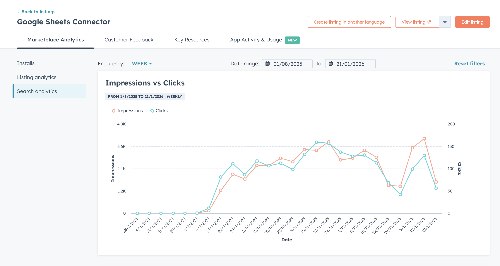
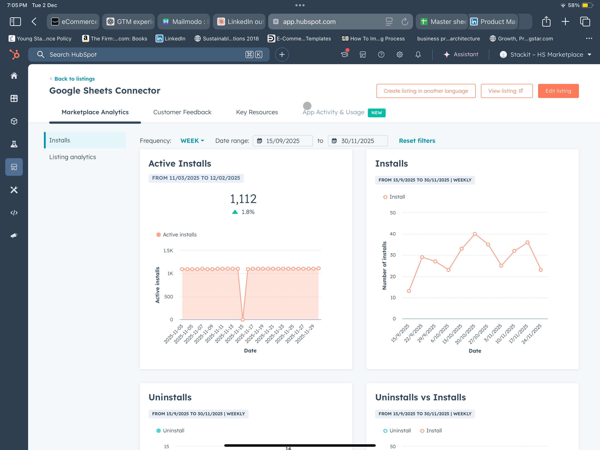
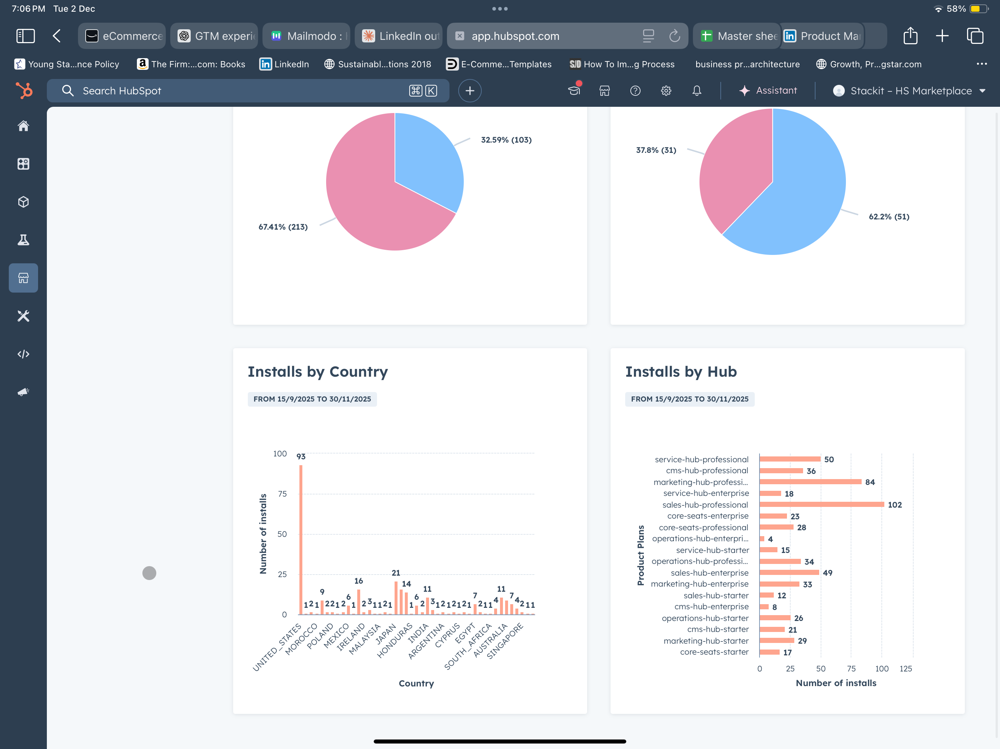
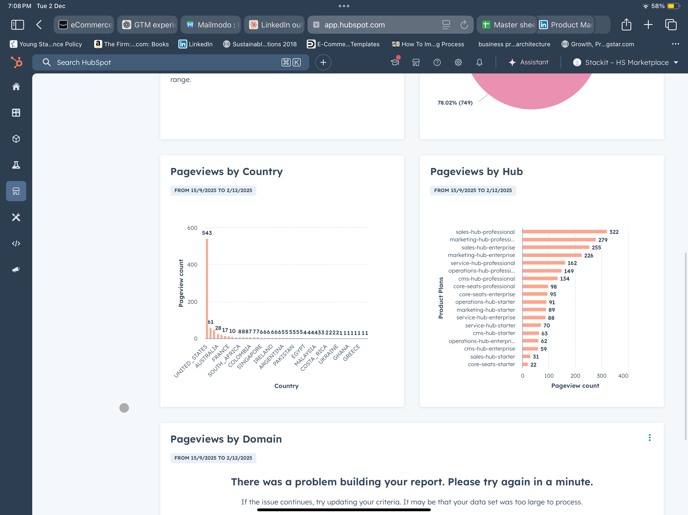

# HubSpot Marketplace Optimization — App Store SEO


---

## TL;DR

Superjoin's HubSpot Marketplace listing had **zero organic discovery** — flat impressions and clicks from January to August 2025. The listing existed but was invisible to the 200K+ HubSpot users searching the marketplace each month.

Over one month (Aug–Sep 2025), I reverse-engineered the HubSpot Marketplace ranking algorithm, conducted keyword research using search volume data, rebuilt the listing from scratch, and deployed keyword batches iteratively every week.

**Results (Sep–Nov 2025):**
- Weekly impressions: ~0 → **3,600**
- Weekly clicks: ~0 → **160**
- Active installs: **1,112** (+1.8% MoM)
- Monthly install velocity: 50 → 150 → 120 (**3x growth**)
- Paid installs: **103** (32.6% of total)
- Top install hub: **sales-hub-enterprise** — the target ICP



*HubSpot Marketplace Search Analytics — Jan 2025 to Jan 2026 (weekly)*

---

## The Problem

### Starting state (Jan–Aug 2025)

Before optimization, the Superjoin listing had three compounding failure points:

**1. Discoverability failure**
The HubSpot Marketplace search algorithm surfaces apps based on keyword relevance in the title, category tags, keyword tags, and feature descriptions. Superjoin's listing had no keyword signals — it wasn't entering the search candidate pool for any of the terms its target users were searching.

**2. Listing quality failure**
- Title was generic — identical in structure to the main competitor
- Only 1 feature listed, and it was **written in Spanish**
- Missing from key high-traffic categories (Reporting & Dashboards)
- Feature descriptions written as product marketing copy, not keyword-optimized content

**3. Authority gap**
- 15 reviews vs Coefficient's 77
- 1,112 active installs vs Supermetrics' 9,000+
- No HubSpot certification badge

---

## Methodology

### Step 1 — Algorithm reverse-engineering

Before touching any keywords, I mapped how the HubSpot Marketplace ranking algorithm works. There are two distinct layers — and conflating them is the most common optimization mistake:

**Layer 1: Discovery — determines which ~30 apps appear in search results**

| Signal | Weight | What it controls |
|---|---|---|
| App title | High | Exact-match and partial-match keyword indexing |
| Category tags | High | 2 primary categories assigned to the listing |
| Keyword tags | High | Up to 6 tags — direct input to the search index |
| Feature descriptions | Medium | Keyword density parsed per feature block |

**Layer 2: Ranking — determines order within the discovered apps**

| Signal | Approx. weight | What it controls |
|---|---|---|
| Installs | ~20% | Total active installs |
| Certification badge | ~20% | HubSpot "App Certified" status |
| Review count | ~15% | Total reviews + recency |
| Star rating | ~15% | Average rating |

> **Key insight:** A listing with perfect reviews won't appear in search if it has no keyword signals — it never enters the candidate pool. Superjoin's zero-impression problem was a **discovery problem**, not a ranking problem. Fixing reviews or installs first would have had zero impact on impressions.

---

### Step 2 — Competitive analysis

Benchmarked the top 4 competitors to understand what keyword signals the algorithm was rewarding:

| Competitor | Installs | Reviews | Rating | Price | Key strength |
|---|---|---|---|---|---|
| Coefficient | 5,000+ | 77 | 4.8 | Free tier | Market leader, strong keyword coverage |
| Basic Google Sheets Integration | — | 218 | 2.7 | Free | Highest review volume |
| Supermetrics | 9,000+ | — | — | $37/mo | Highest installs, brand recognition |
| Windsor.ai | — | — | — | — | Niche data connectors |

**What competitors had that Superjoin's listing lacked:**
- High-volume search terms embedded in titles
- All 6 keyword tag slots populated
- Multiple categories including Reporting & Dashboards
- Feature descriptions written around search intent, not product positioning

---

### Step 3 — Keyword research

Identified target keywords by monthly search volume and organized into tiers based on competition and product fit:

**Tier 1 — High volume, high intent:**

| Keyword | Monthly volume | User intent |
|---|---|---|
| google sheets integration | 8,100 | Tool connection |
| data sync | 5,500 | Core use case |
| data export | 4,200 | Core use case |
| spreadsheet | 3,900 | Tool connection |
| google sheets | 3,600 | Tool connection |

**Tier 2 — Medium volume, strong product fit:**

| Keyword | Monthly volume | User intent |
|---|---|---|
| data import | 2,900 | Core use case |
| reporting | 2,400 | Use case |
| google sheets sync | 1,800 | Specific use case |
| export to sheets | 1,600 | Specific use case |
| crm data export | 1,200 | HubSpot-specific |

**Tier 3 — Long-tail, lower competition:**
hubspot google sheets, sheets connector, crm sync spreadsheet, data connector, automated reporting

**Competitive brand keywords (deprioritized):**
Supermetrics, Coefficient, data studio — high volume but dominated by established players with superior authority signals. Avoided spending keyword budget on terms where Superjoin couldn't rank in the short term.

---

### Step 4 — Keyword placement strategy

App store SEO follows a **keyword placement hierarchy** — the same term carries different ranking weight depending on where it appears:

```
Title > Keyword Tags > Category Tags > Feature Description (opening line) > Feature Description (body)
```

**Placement decisions made:**

| Placement | Strategy |
|---|---|
| **Title** | Lead with highest-volume exact-match term + product differentiator |
| **Category tags (2 slots)** | Primary: Data Sync. Added: Reporting & Dashboards (was previously missing) |
| **Keyword tags (6 slots)** | T1 + T2 terms split across tool-connection and use-case intent clusters |
| **Feature descriptions** | Each block rewritten — primary keyword in the opening sentence, supporting terms in the body |

**Keyword density principle:** Each feature description was rewritten so the primary target keyword appears in the first sentence — the highest-weighted text segment for the algorithm's content parsing. This mirrors on-page SEO above-the-fold keyword placement, applied to app store context.

**Semantic keyword clustering:** Feature descriptions were structured around keyword clusters, not single terms — e.g. a block targeting "data export" also naturally covered "google sheets export", "scheduled export", and "crm export" to capture long-tail variants without keyword stuffing.

---

### Step 5 — Iterative weekly deployment

Rather than changing everything simultaneously, deployed in **weekly keyword batches** — each week a controlled experiment:

| Week | Changes deployed | Signal monitored |
|---|---|---|
| Week 1 | Title rewrite + category tags | Baseline impression change |
| Week 2 | All 6 keyword tag slots populated with T1 terms | Search query impression delta |
| Week 3 | Feature descriptions rewritten — keyword density optimized | Per-feature impression contribution |
| Week 4 | T2 + long-tail integration. Feature count expanded from 1 → full set | CTR and sustained impression rate |

> **The inflection point** at mid-September 2025 corresponds to Week 3 — feature description rewriting. This was the single highest-impact change, confirming that keyword density in feature copy was the primary discovery gap, ahead of title and tag changes.

---

## Results

### Search analytics — impressions and clicks

| Metric | Before (Jan–Aug 2025) | Peak (Nov 2025) | Growth |
|---|---|---|---|
| Weekly impressions | ~0 | ~3,600 | **3x+ sustained** |
| Weekly clicks | ~0 | ~160 | **3x+ sustained** |
| Implied CTR | — | ~4.4% | Baseline established |

The Impressions vs Clicks chart shows three distinct phases:

1. **Invisible (Jan–Aug 2025):** Zero impressions, zero clicks. No discovery.
2. **Breakthrough (Aug–Sep 2025):** Step-change growth from each weekly batch deployment.
3. **Sustained (Oct–Nov 2025):** ~3,600 impressions and ~160 clicks/week. Impressions and clicks move in tight correlation — validating CTR consistency, not a spike.

---

### Install analytics — Sep 15 to Nov 30, 2025

**Volume:**

| Metric | Value |
|---|---|
| Active installs | **1,112** (+1.8% MoM) |
| Monthly installs (Sep) | ~50 |
| Monthly installs (Oct) | ~150 |
| Monthly installs (Nov) | ~120 |
| Install velocity growth | **3x (Sep → Oct)** |

**Free vs Paid split:**

| Tier | Installs | % |
|---|---|---|
| Free | 213 | 67.4% |
| Paid | 103 | **32.6%** |

> **32.6% paid install rate** is a strong signal — users discovering the listing via search are converting to paid at meaningful rates. The keyword strategy attracted high-intent users, not just browsers.

**Uninstalls (Sep–Nov):** 7 → 36 → 39 — growing with install volume, proportional. Uninstall-to-install ratio remains healthy.



---

### Who is installing — ICP validation

**Installs by HubSpot Hub (top):**

| Hub | Installs |
|---|---|
| sales-hub-enterprise | **102** |
| marketing-hub-professional | 84 |
| service-hub-professional | 50 |
| core-seats-professional | 28 |
| sales-hub-professional | 23 |

**sales-hub-enterprise is the #1 install hub** — this is the highest-value HubSpot tier and the core Superjoin ICP. The keyword strategy didn't just drive volume; it attracted the right users.

**Installs by country (top):** United States (93), Morocco (9), Poland (22), Mexico (22), Ireland (16), Malaysia (14)



---

### Listing pageview analytics — Sep 15 to Dec 2, 2025

| Metric | Value |
|---|---|
| Total pageviews | ~1,217 |
| Monthly pageviews (Sep) | ~320 |
| Monthly pageviews (Oct) | ~470 |
| Monthly pageviews (Nov) | ~470 |

**Pageview source:**
- In-App (HubSpot marketplace search): **78.88% (960 views)**
- Public (direct / external traffic): **21.12% (257 views)**

> Nearly 79% of listing views are coming from in-app search — confirming the optimization is working through the marketplace's own discovery mechanism, not external referrals.

**Top pageview hubs:** sales-hub-professional (322), marketing-hub-professional (279), sales-hub-enterprise (255) — again ICP-matched.

**Top pageview countries:** United States (543), Australia (61), South Africa (28)



---

## What's Still to Optimize

The listing optimization addressed the **discovery layer**. The **ranking layer** — installs, reviews, badge — is the next growth ceiling:

| Priority | Action | Impact |
|---|---|---|
| High | Review generation campaign — close gap to competitor's 77 (currently 15) | ~15% ranking weight |
| High | HubSpot App Certification — badge status | ~20% ranking weight |
| Medium | CTR optimization — listing screenshots, social proof, above-the-fold copy | Improve 4.4% CTR baseline |
| Medium | Competitive pricing framing vs Supermetrics ($37/mo) and Coefficient | Conversion rate |
| Low | Install velocity growth marketing | Compounds authority signal over time |

---

## Research Reference

Full keyword research, competitive analysis, tier mapping, and algorithm notes:
**[HubSpot Marketplace Listing Research Spreadsheet](https://docs.google.com/spreadsheets/d/1qm5BFJ_nySUJBtlNTaY946vjdDcbIwE5_BBFyhDlTtg)**

---

## Stack

| Tool | Role |
|---|---|
| **HubSpot Marketplace** | Listing platform + search analytics |
| **Google Keyword Planner** | Monthly search volume data |
| **HubSpot Search Analytics** | Weekly impression + click tracking |
| **Google Sheets** | Keyword tiering, competitive analysis, placement mapping |
