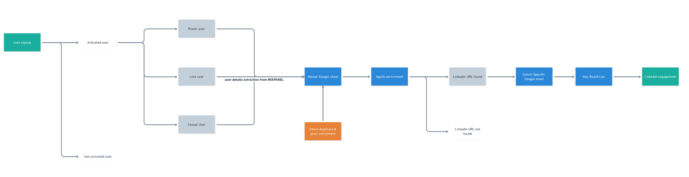
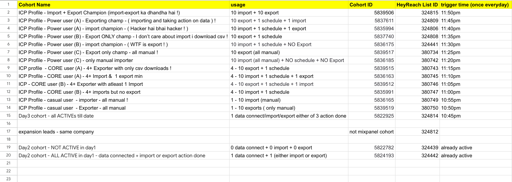
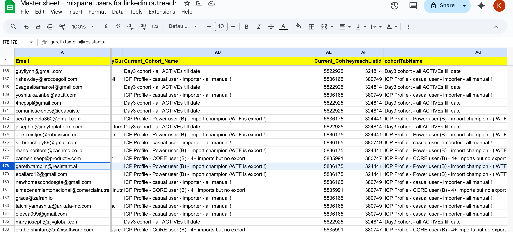
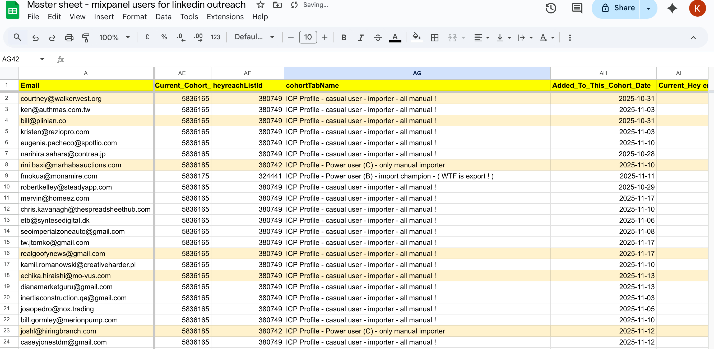
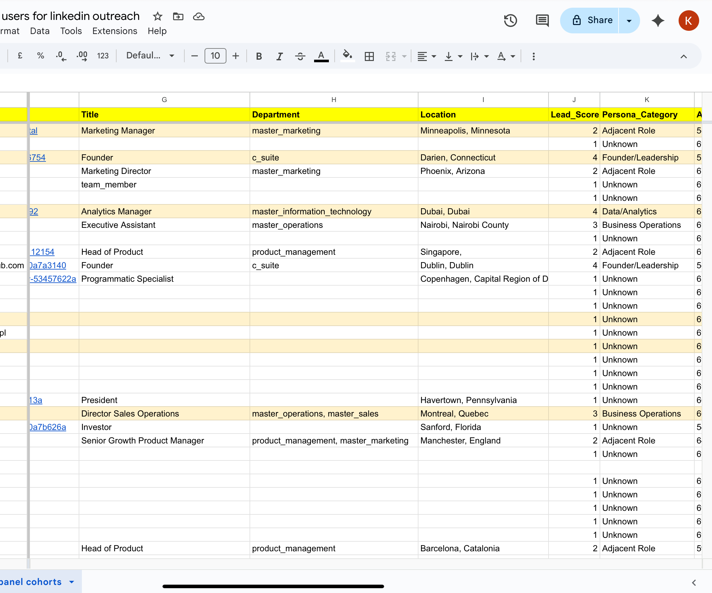
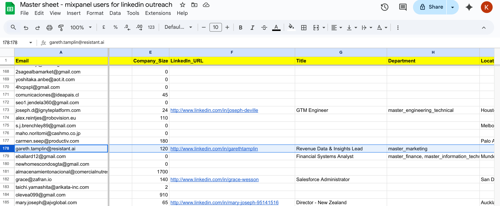
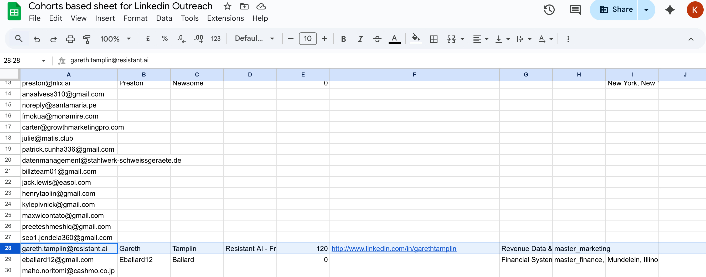

# 🤖 AI SDR — Autonomous LinkedIn Outreach System
### Built at [Superjoin AI](https://superjoin.ai) · December 2025

> An end-to-end GTM automation that identifies high-intent free-trial users, enriches them with professional data, and engages them on LinkedIn — fully autonomously. No human in the loop for identification, enrichment, or outreach.

---

## 📌 TL;DR

| What | Detail |
|------|--------|
| **Type** | AI-powered outbound automation (AI SDR) |
| **Channel** | LinkedIn (via HeyReach) |
| **Target** | Free-trial users (21-day window) in activation stage |
| **Stack** | Mixpanel · Apollo.io · n8n · Google Sheets · HeyReach |
| **Scale** | 13 cohorts · 13 n8n workflows · 13 HeyReach lists |
| **Outcome** | 10–20% LinkedIn reply rate · 80% Apollo enrichment success |

---

## 🧠 Why This Was Built

Superjoin's free-trial users were activating but not converting. Email outreach had hit a ceiling — high block rates (7–11% on key campaigns) and declining open rates meant the channel was damaged.

LinkedIn offered a higher-leverage alternative: reach users at the exact moment they're hands-on with the product, with a message from the founder, in a channel they actually check.

The problem: doing this manually at scale is impossible. The solution: build an autonomous system that mimics what a great SDR would do — identify the right users, research them, and reach out with context.

**Vision:** Every GTM touchpoint — email, LinkedIn, in-product support, docs chat — should be AI-led and fully automated. This system is the first step toward that end-to-end autonomous GTM engine.

---

## 🏗️ System Architecture



```
User Signup (Free Trial)
        │
        ▼
   Activated?
   ├── YES → Classified into Cohort (Power / Core / Casual / Day3)
   │              │
   │              ▼
   │         Mixpanel Cohort API
   │              │
   │              ▼
   │     Master Google Sheet (CRM)
   │       ├── Already enriched? → Skip Apollo call
   │       └── Not enriched? → Apollo /people/match
   │                                │
   │                          LinkedIn URL found?
   │                          ├── YES → Cohort Tab → HeyReach List → LinkedIn Outreach
   │                          └── NO  → Stored, status = no_linkedin
   │
   └── NO → Not entered into outreach flow
```

### Tool Stack

| Platform | Role |
|----------|------|
| **Mixpanel** | Behavioral tracking — identifies users by product usage events |
| **Apollo.io** | Professional enrichment — LinkedIn URL, title, company, seniority |
| **Google Sheets** | Central CRM — deduplication, cohort tracking, status management |
| **HeyReach** | LinkedIn outreach — connection requests + message sequences |
| **n8n** | Orchestration — 13 workflows on staggered daily schedules |

---

## 👥 Cohort Structure

Users are segmented into 13 cohorts based on product usage intensity, tracked in Mixpanel. Each cohort has a dedicated n8n workflow, Google Sheet tab, and HeyReach list.



| Tier | Cohort | Usage Signal | HeyReach List | Trigger |
|------|--------|-------------|--------------|---------|
| **Power** | Import + Export Champion | 10 import + 10 export | 324815 | 11:50pm |
| **Power** | Power user (A) - Exporting champ | 10 export + 1 schedule + 1 import | 324809 | 11:45pm |
| **Power** | Power user (A) - Import champion | 10 import + 1 schedule + 1 export | 324806 | 11:40pm |
| **Power** | Power user (B) - Export ONLY | 10 export + 1 schedule | 324808 | 11:35pm |
| **Power** | Power user (B) - Import champion | 10 import + 1 schedule + NO export | 324441 | 11:30pm |
| **Power** | Power user (C) - Export only manual | 10 export (all manual) | 380734 | 11:25pm |
| **Power** | Power user (C) - Only manual importer | 10 import (all manual) + NO schedule | 380742 | 11:20pm |
| **Core** | CORE user (A) - 4+ Exporter csv | 4–10 export + 1 schedule | 380743 | 11:15pm |
| **Core** | CORE user (A) - 4+ Import & 1 export | 4–10 import + 1 schedule + 1 export | 380745 | 11:10pm |
| **Core** | CORE user (B) - 4+ Exporter + 1 Import | 4–10 export + 1 schedule + 1 import | 380746 | 11:05pm |
| **Core** | CORE user (B) - 4+ imports no export | 4–10 import + 1 schedule | 380747 | 11:00pm |
| **Casual** | Casual user - importer all manual | 1–10 import (manual) | 380749 | 10:55pm |
| **Casual** | Casual user - Exporter all manual | 1–10 exports (only manual) | 380750 | 10:50pm |
| **Entry** | Day3 cohort - all ACTIVEs till date | Any 1 of: connect / import / export | 324814 | 10:45pm |
| **Expansion** | Expansion leads - same company | Not Mixpanel cohort — Apollo org search | 324812 | Triggered |

> **Stagger logic:** Day3 fires first at 10:45pm, Power users last at 11:50pm. 5-minute gaps prevent Mixpanel API rate limit breaches (max 5 concurrent, 60/hour).

---

## ⚙️ How the Automation Works — Node by Node

Each of the 13 workflows follows the same pattern. The only thing that changes is the **Cohort Configuration** node — one code block with `cohortId`, `heyreachListId`, and `sheetTabName`.



### Workflow Sequence

```
1. Schedule Trigger (daily, staggered time)
        ↓
2. Cohort Configuration
   └── Sets: cohortId, heyreachListId, sheetTabName
        ↓
3. Mixpanel Fetch
   └── HTTP POST → Engage API, filter_by_cohort
        ↓
4. Parse ALL Mixpanel Users
   └── Normalise email (lowercase + trim)
   └── Extract firstName, companyGuess from email string
        ↓
5. Rate Limit (2s wait)
        ↓
6. Lookup in Master Sheet
   └── Match by Email column
   └── alwaysOutputData: true — never breaks on empty result
        ↓
7. Merge
   └── Combines Mixpanel data + Master Sheet lookup on Email key
        ↓
8. Check Existing Enrichment Status  ← DEDUPLICATION BRAIN
   └── Sets 4 control flags (see Deduplication section)
        ↓
9. Needs Apollo Enrichment? (IF branch)
   ├── TRUE  → Rate Limit (3s) → Apollo /people/match → Process & Score ICP → Merge1
   └── FALSE → Skip Apollo call (already enriched) → Merge1
        ↓
10. Update Master Sheet (ALL USERS)
    └── appendOrUpdate on Email key
        ↓
11. Update Cohort Tab (ALL USERS)
    └── Same write to cohort-specific tab
        ↓
12. Qualify for HeyReach? (IF branch)
    ├── LinkedIn_URL not empty → Send to HeyReach
    └── No LinkedIn URL → End (user stored, not sent)
        ↓
13. Send to HeyReach
    └── POST to AddLeadsToListV2 with persona, leadScore, cohort as customFields
        ↓
14. Prepare HeyReach Status Update
    └── Sets HeyReach_Status: 'Sent', locks First_HeyReach_List_ID + First_Sent_Date
        ↓
15. Update Master + Cohort Tab (dual write)
    └── Status confirmed in both sheets
```

### Expansion Track (parallel — high-ICP users only)

```
After Step 9, if Lead_Score ≥ 4 AND Match_Confidence ≥ 80 AND Company_Size > 10:
        ↓
Apollo /mixed_people/search
└── Finds other ICP-matching people at the same company (by Apollo org ID)
└── Target titles: RevOps, Marketing Ops, Data Analyst, Analytics Manager...
        ↓
Process Expansion Leads → Score each lead
        ↓
Expansion Score ≥ 3? → Send to HeyReach Expansion List (324812)
                     → Update Expansion Sheet
```

---

## 🔁 Deduplication & Status Logic

This is the core of what makes the system safe to run daily across 13 cohorts without ever double-messaging a user.

### 4 Control Flags

| Flag | Set When | Effect |
|------|----------|--------|
| `needsApolloEnrichment` | `Apollo_Person_ID` is empty in Master Sheet | Gates Apollo API call — saves 35–45 calls/week |
| `skipHeyreach` | `HeyReach_Status` = `Sent` or contains `Already Sent` | Prevents duplicate LinkedIn outreach across cohorts |
| `wasEnriched` | `Apollo_Person_ID` exists | Carries Apollo data forward without re-calling API |
| `isNewUser` | No `First_Seen_Cohort` or `Enrichment_Date` in sheet | Distinguishes net-new vs returning user |

### All Scenarios Handled

| Scenario | What Happens |
|----------|-------------|
| **New user, first time** | Appended to Master Sheet → Apollo called → LinkedIn found → HeyReach sent → Status: `Sent` |
| **Same user, next day** | Lookup finds row → Apollo skipped → `HeyReach_Status = Sent` → NOT re-sent |
| **User upgrades cohort** | New workflow runs → `First_Seen_Cohort` preserved → `Last_Seen_Cohort` updated → HeyReach blocked: `Already Sent in '[cohort]'` |
| **No LinkedIn URL** | Enrichment stored, `Qualify for HeyReach?` fails → In sheet, not sent |
| **Apollo match fails** | `continueRegularOutput` → workflow continues → `Enrichment_Status: Not Enriched` → Written to sheet |
| **HeyReach API fails** | `continueRegularOutput` → workflow continues → User stays `Pending` in sheet |

---

## 🗄️ Google Sheet as CRM

Three sheets working together as a lightweight CRM for the full outreach pipeline.

### Sheet 1 — Mixpanel ↔ HeyReach Mapping
Config sheet. Maps every Mixpanel Cohort ID to its HeyReach List ID and daily trigger time.

### Sheet 2 — Master Sheet (`All users in mixpanel cohorts`)
Every user who has ever passed through any cohort. One row per user. Updated on every daily run. ~186 users as of December 2025.







| Column Group | Fields |
|-------------|--------|
| Identity | `Email`, `First_Name`, `Last_Name`, `Mixpanel_ID` |
| Professional | `Title`, `Department`, `Company_Name`, `Company_Size`, `Location`, `LinkedIn_URL` |
| ICP | `Lead_Score` (1–5), `Persona_Category`, `Match_Confidence` |
| Apollo | `Apollo_Person_ID`, `Source_Company_apolloOrgId`, `Enrichment_Date`, `Enrichment_Status` |
| Cohort Journey | `First_Seen_Cohort`, `First_Seen_Date`, `Last_Seen_Cohort`, `Last_Seen_Date`, `Current_Cohort_Name` |
| HeyReach | `HeyReach_Status`, `First_HeyReach_List_ID`, `First_Sent_Date`, `Current_HeyReach_List_ID` |
| System | `Last_Updated`, `needsApolloEnrichment`, `wasEnriched`, `skipHeyreach` |

### Sheet 3 — Cohort-Based Sheet
One tab per cohort. Each tab mirrors Master Sheet schema scoped to that cohort's users. Tab name matches `sheetTabName` in Cohort Configuration and maps directly to a HeyReach list.



---

## 📊 ICP Scoring Model

Leads are scored 1–5 automatically using Apollo title and department data:

| Score | Persona | Criteria |
|-------|---------|---------|
| **5** | RevOps / Marketing Ops | revops, revenue operations, marketing ops, mops |
| **4** | Data / Analytics | data analyst, analytics manager, business analyst, data scientist |
| **4** | Founder / Leadership | Founder or CEO at company < 100 employees |
| **3** | Business Operations | business operations, operations manager |
| **2** | Adjacent Role | manager, director, product, sales ops |
| **1** | Unknown | No match or insufficient Apollo data |

Expansion outreach only fires for Score ≥ 4 + Match Confidence ≥ 80 + Company Size > 10.

---

## 📈 Key Metrics

| Metric | Value |
|--------|-------|
| Leads entering automation weekly | **30–50** |
| Enriched leads weekly (Apollo) | **5–15** |
| Apollo enrichment success rate | **~80%** |
| LinkedIn reply rate | **10–20%** |
| Apollo API calls saved via deduplication | **35–45 / week** |
| Active cohorts | **13** |
| Active n8n workflows | **13** |

---

## 🎯 Outcome Funnel

> *Full funnel data being compiled. Confirmed metrics marked ✅ — remaining pending Superjoin analytics approval.*

```
Free Trial Signups (monthly)             → [TO ADD]
        │
        ▼
Activated → Entered Cohorts              → [TO ADD: % activation rate]
        │
        ▼
Users Across All 13 Cohorts              → ~186 (Master Sheet, Dec 2025) ✅
        │
        ▼
Apollo Enriched                          → ~80% enrichment rate ✅
        │
        ▼
LinkedIn URL Found → Sent to HeyReach    → [TO ADD: total sent count]
        │
        ▼
Connection Accepted                      → [TO ADD: acceptance rate]
        │
        ▼
Message Delivered                        → [TO ADD]
        │
        ▼
Replied on LinkedIn                      → 10–20% reply rate ✅
        │
        ▼
Qualified → Handed to Founders (SQL)     → [TO ADD]
        │
        ▼
Converted to Paid                        → [TO ADD: free-to-paid lift %]
```

### Data Points to Complete the Funnel

| # | Data Point | Source | Status |
|---|-----------|--------|--------|
| 1 | Monthly free-trial signups | Mixpanel | ⬜ Pending |
| 2 | % of signups that activate | Mixpanel activation funnel | ⬜ Pending |
| 3 | Total users in Master Sheet | Master Sheet row count | ✅ ~186 |
| 4 | Users with LinkedIn URL enriched | Master Sheet filter | ⬜ Pending |
| 5 | Total sent to HeyReach | `HeyReach_Status = Sent` count | ⬜ Pending |
| 6 | Connection acceptance rate | HeyReach analytics | ⬜ Pending |
| 7 | Message delivery rate | HeyReach analytics | ⬜ Pending |
| 8 | LinkedIn reply rate | HeyReach analytics | ✅ 10–20% |
| 9 | SQL handoffs to founders | HeyReach replies / tracking | ⬜ Pending |
| 10 | Free-to-paid conversions via LinkedIn | Stripe + cohort overlap | ⬜ Pending |
| 11 | Before/after free-to-paid rate | Stripe baseline vs post-launch | ⬜ Pending |

---

## 🔧 Technical Notes & Guardrails

### Known Issues & Mitigations

**1. Mixpanel API Fragility**
Uses HTTP POST to Engage API — not an official n8n integration. Can break if auth expires or cohort IDs change in Mixpanel.
→ Fix: Each cohort in its own workflow. Cohort IDs stored in single config node — one place to update.

**2. Data Merge on Email Key**
Mixpanel + Apollo merge on `Email`. Case or whitespace differences silently break the merge — Apollo data won't attach.
→ Fix: All emails lowercased and trimmed at the parse step before any lookup.

**3. HeyReach JSON Sensitivity**
HeyReach API fails silently on malformed JSON. A trailing comma in `customFields` causes the entire API call to fail with no error returned.
→ Fix: Validate JSON manually. Always test with a single lead before batch sends.

**4. Google Sheets Empty Lookup**
Empty lookup results terminate the workflow by default.
→ Fix: `alwaysOutputData: true` + `continueRegularOutput` on the Lookup node. Null checks before enrichment step.

### Best Practices for Reuse
- One cohort = one workflow (Mixpanel rate limit management)
- Stagger schedules with minimum 5-min gaps between workflows
- Use `Run Once for Each Item` in all Code nodes
- Manual field mapping over Auto-map for Google Sheets writes
- Always validate `Apollo_Person_ID` AND `LinkedIn_URL` before HeyReach call

---

## 🗺️ Roadmap

### Phase 1 — AI-Personalized Messaging *(next)*
Generate hyper-personalized outreach using combined signals:
- **Cohort context:** "I noticed you've been importing data regularly..."
- **Tool integration:** "You connected HubSpot — here's how others use Superjoin with it..."
- **Professional context:** Role-specific messaging based on Apollo title and department

### Phase 2 — Enhanced Behavioral Signals
- Track Superjoin AI copilot usage patterns
- Build cohorts around specific feature adoption (schedules, exports, AI queries)
- Deeper tool integration tracking beyond `config_created` event

### Phase 3 — Omnichannel AI Orchestration
- **Email:** Track opens/clicks/replies → adjust LinkedIn timing accordingly
- **LinkedIn:** Dynamic messaging based on real-time user state across channels
- **Support bot:** Trigger outreach based on in-product or docs engagement

---

## 📁 Repo Structure

```
linkedin-outbound-ai-sdr/
├── README.md
├── workflow/
│   └── day3-cohort-all-actives.json    ← importable n8n workflow (Day3 cohort)
└── assets/
    ├── system-architecture.png         ← end-to-end flow diagram
    ├── n8n-workflow-canvas.png         ← full n8n canvas screenshot
    ├── cohort-mapping-sheet.png        ← Mixpanel ↔ HeyReach config sheet
    ├── master-sheet-left.png           ← Master Sheet: email → LinkedIn URL columns
    ├── master-sheet-right.png          ← Master Sheet: cohort → HeyReach status columns
    ├── master-sheet-icp.png            ← Master Sheet: ICP score + persona columns
    └── cohort-tab-example.png          ← Live cohort tab with real user data
```

---

## 🔗 Related Work

This system is part of a broader GTM automation stack built at Superjoin:

| Project | What | Outcome |
|---------|------|---------|
| **Email Campaign 2.0** | Rebuilt free-trial drip — 3-week journey framework, reduced block rates | Block rate down from 11% on key campaigns |
| **HubSpot Marketplace Optimization** | SEO + listing algo research to improve discovery | **3x growth** in impressions and clicks |
| **LinkedIn Outbound AI SDR** | This project | 10–20% reply rate · 13 cohorts live |

---

*Built by [Karan Babbar](https://linkedin.com/in/karanbabbar) · GTM Engineer & AI Builder*
*Document Version 1.1 · December 2025*
